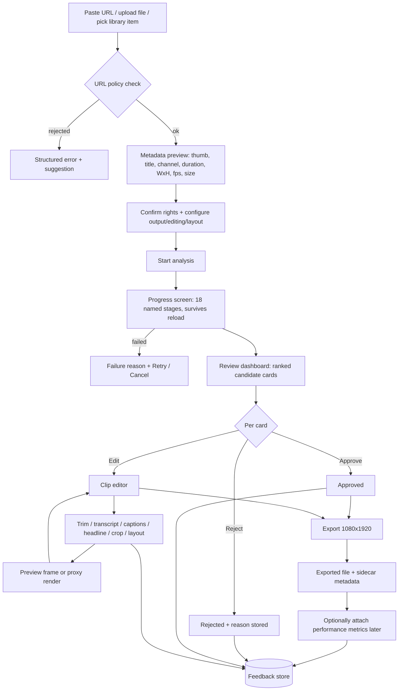
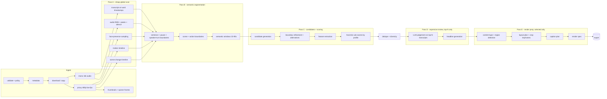
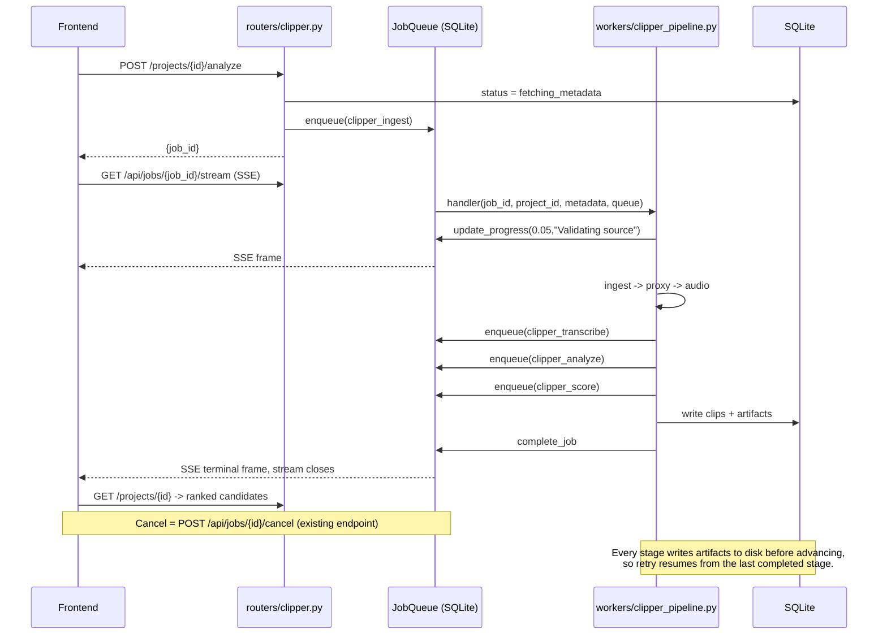
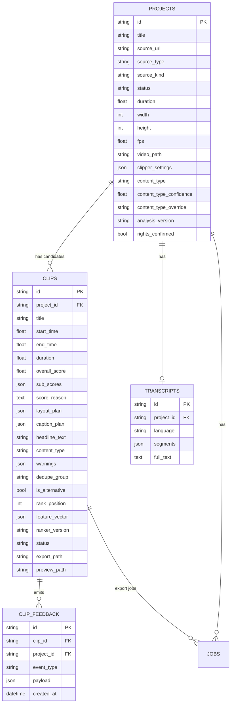
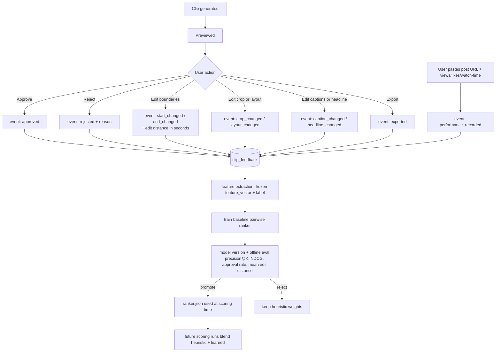
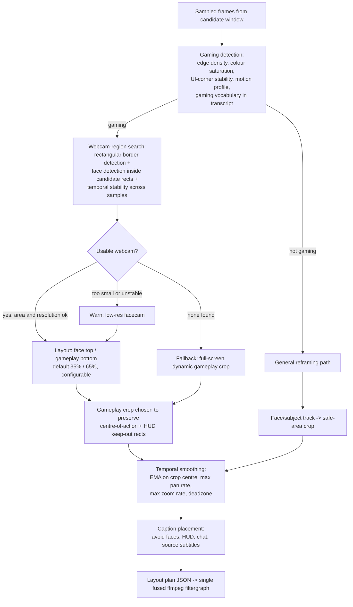

# AI Stream Clipper — Architecture

Companion to `ai-stream-clipper-repository-audit.md`. This document is the **contract**: every
module below is implemented exactly to the signatures given here, so the pieces compose without
re-negotiation.

Route: **`/ai-stream-clipper`** · API prefix: **`/api/clipper`** · artifact root:
**`data/clipper/{project_id}/`**

---

## 1. User flow



## 2. Processing pipeline (hierarchical — brief §8)



**The rule that makes this affordable:** Pass A and B read only the **proxy** and the
**transcript**. Pass D runs on at most `top_n_llm` candidates (default 8) and only if an LLM
engine is configured. Pass E runs only for clips the user actually renders. The full-resolution
source is opened exactly once per exported clip.

## 3. Job orchestration



Stage names surfaced to the user (brief §26) are the exact strings written by
`update_progress`: *Validating source · Reading metadata · Downloading · Creating proxy ·
Extracting audio · Transcribing · Detecting scenes · Detecting faces and regions · Detecting
content type · Building semantic segments · Creating candidates · Scoring candidates · Removing
duplicates · Preparing layouts · Generating previews · Ready for review · Rendering export ·
Completed.*

## 4. Data model



On-disk artifacts (**not** in SQLite):

```
data/clipper/{project_id}/
  source/            downloaded original (or a symlink/copy of an upload)
  proxy/proxy.mp4    ~480px wide, 10 fps, no audio  -- every analysis pass reads this
  audio/speech.wav   mono 16 kHz PCM                -- transcription + energy
  frames/            sparse sampled JPEGs
  thumbs/            per-candidate thumbnails
  analysis/
    signals.json     {audio_rms[], peaks[], silence[], scenes[], motion[]}
    faces.json       sampled face boxes over time
    regions.json     detected webcam / gameplay / chat / HUD rectangles
    segments.json    Pass B semantic windows
    candidates.json  pre-dedupe candidates with features
    meta.json        analysis_version, model versions, timings
  previews/{clip_id}.mp4
  exports/{clip_id}.mp4 + {clip_id}.json sidecar
```

## 5. Feedback and model-training loop



**Label definition:** positive = exported (strongest), then approved; negative = rejected.
Unreviewed clips are excluded, not treated as negatives. **Guardrail:** the learned model is
only used when it beats the heuristic baseline on held-out NDCG@5 *and* at least
`min_training_examples` (default 40) labelled clips exist. Otherwise the heuristic weights stand
and the UI says so.

## 6. Gaming layout pipeline



**The one fused encode.** A gaming export becomes a single ffmpeg invocation of the shape:

```
[0:v] trim/crop(face_rect)   -> scale 1080x672  -> [top]
[0:v] trim/crop(game_rect)   -> scale 1080x1248 -> [bot]
[top][bot] vstack -> subtitles=captions.ass -> yuv420p -> libx264
```

Never two passes. Same rationale as `remix_pipeline._stage_match_and_caption`.

---

## 7. Module contracts

All modules live under `server/services/clipper/`. Every function is pure-ish: it takes paths and
dicts and returns dicts; none of them touch the DB or the job queue. That keeps them unit-testable
without a database, which is how the existing `test_tiktok_transform.py` storage tests work.

### `urlguard.py`
```python
class UrlRejected(Exception):
    def __init__(self, code: str, message: str, suggestion: str = "") -> None: ...

ALLOWED_SCHEMES = {"http", "https"}
ALLOWED_PORTS   = {80, 443}

def check_url(url: str, *, allow_private: bool = False) -> dict:
    """Return {'url','host','scheme','port','source_type','addresses'} or raise UrlRejected.
    Rejects: bad scheme, credentials in URL, non-allowed port, unresolvable host, and any host
    whose resolved A/AAAA set includes loopback / private / link-local / CGNAT / multicast /
    reserved / unspecified addresses."""

def is_blocked_ip(ip: str) -> bool: ...
MAX_REDIRECTS = 3
```

### `storage.py`
```python
def project_dir(project_id: str) -> Path: ...
def paths(project_id: str) -> dict[str, Path]:
    """Keys: root, source_dir, proxy_dir, proxy, audio_dir, audio, frames_dir, thumbs_dir,
    analysis_dir, previews_dir, exports_dir, signals, faces, regions, segments, candidates, meta"""
def ensure_dirs(project_id: str) -> None: ...
def write_artifact(project_id: str, name: str, data: dict | list) -> Path:   # atomic
def read_artifact(project_id: str, name: str) -> dict | list | None: ...
def artifact_exists(project_id: str, name: str) -> bool: ...
def delete_project(project_id: str) -> None: ...
def dir_size_bytes(project_id: str) -> int: ...
ARTIFACT_NAMES: frozenset[str]   # allowlist for the HTTP artifacts endpoint
```

### `ingest.py`
```python
async def probe_source(url: str) -> dict:
    """URL policy + yt-dlp metadata. Returns metadata dict or {'error','error_code','suggestion'}."""

async def ingest_source(project_id: str, *, url: str | None, local_path: str | None,
                        max_duration_s: float, min_free_bytes: int,
                        on_progress=None, is_cancelled=None) -> dict:
    """Download or copy -> returns {'video_path','duration','width','height','fps','filesize'}."""

async def build_proxy(project_id: str, video_path: str, *,
                      width: int = 480, fps: int = 10) -> str: ...
async def extract_audio(project_id: str, video_path: str) -> str:      # mono 16 kHz wav
async def extract_thumbnail(project_id: str, video_path: str, t: float, name: str) -> str: ...
async def sample_frames(project_id: str, proxy_path: str, times: list[float]) -> list[str]: ...
def check_disk_space(min_free_bytes: int) -> None:  # raises RuntimeError
```

### `signals.py` — Pass A
```python
def audio_timeline(wav_path: str, *, hop_s: float = 0.25) -> dict:
    """{'hop_s', 'rms': [..], 'peaks': [t,..], 'silence': [[s,e],..], 'speech': [[s,e],..]}
    Computed with ffmpeg astats/silencedetect — no full decode into Python."""

def scene_timeline(proxy_path: str, *, threshold: float = 0.30) -> list[float]:
    """Scene-change timestamps via ffmpeg's scdet/select filter."""

def motion_timeline(proxy_path: str, *, hop_s: float = 0.5) -> dict:
    """{'hop_s','motion':[0..1,..]} via frame differencing on the proxy."""

def face_presence(proxy_path: str, times: list[float]) -> list[dict]:
    """[{'t':float,'boxes':[[x,y,w,h],..]}] using cv2 Haar cascades shipped with opencv-python."""

def build_signals(project_id: str, proxy_path: str, wav_path: str, duration: float) -> dict:
    """Runs the above, writes analysis/signals.json, returns it."""
```

### `segmentation.py` — Pass B
```python
def semantic_windows(transcript: dict, signals: dict, *,
                     min_s: float, max_s: float) -> list[dict]:
    """[{'start','end','text','words':[..],'reasons':[..]}]
    Boundaries from: sentence punctuation, pauses > 0.6 s, scene changes, silence edges,
    audio-peak onsets. Never fixed-size chunks."""
```

### `candidates.py` — Pass C
```python
def generate_candidates(windows: list[dict], signals: dict, *,
                        min_s: float, max_s: float, target_s: float) -> list[dict]: ...

def refine_boundaries(cand: dict, transcript: dict, signals: dict, *,
                      min_s: float, max_s: float) -> dict:
    """Snap start to a natural boundary, never mid-word; extend to include the payoff and the
    following reaction; trim trailing dead air but keep meaningful pauses. Returns the candidate
    with 'start','end' updated and 'alternatives': [{'start','end','why'}]."""

def extract_features(cand: dict, transcript: dict, signals: dict, duration: float) -> dict:
    """The frozen numeric feature vector used by both scoring and the ranker."""
```

### `scoring.py`
```python
SUB_SCORES = ("hook","clarity","setup_efficiency","payoff","emotion","novelty",
              "audio_energy","visual_energy","reaction","caption_suitability",
              "platform_fit","context_completeness","retention","edit_confidence",
              "technical","safety")

PROFILES: dict[str, dict[str, float]]   # content_type -> per-sub-score weights

def score_candidate(cand: dict, features: dict, *, profile: str,
                    platform: str) -> dict:
    """{'overall': 0..100, 'sub_scores': {name: 0..100}, 'reason': str}"""

def explain(sub_scores: dict, cand: dict) -> str:
    """One or two factual sentences citing the top contributing signals. No hype."""
```

### `dedupe.py`
```python
def text_similarity(a: str, b: str) -> float:      # token Jaccard x trigram cosine
def overlap_ratio(a: dict, b: dict) -> float:
def deduplicate(cands: list[dict], *, overlap_threshold: float,
                text_threshold: float, target_count: int) -> list[dict]:
    """Assigns 'dedupe_group', marks losers 'is_alternative', then applies a diversity pass
    (spread across the source timeline, mixed content/emotion) and sets 'rank_position'."""
```

### `content_type.py`
```python
CONTENT_TYPES = ("gaming","podcast","interview","irl","commentary","talking_head",
                 "tutorial","sports","low_dialogue","unknown")

def detect_content_type(frames: list[str], signals: dict, transcript: dict) -> dict:
    """{'content_type','confidence','evidence':[str,..]}"""

def detect_regions(frames: list[str]) -> dict:
    """{'webcam': rect|None, 'gameplay': rect|None, 'chat': rect|None, 'hud': [rect,..],
        'confidence': {..}}   rect = {'x','y','w','h'}  in source pixel coords."""
```

### `layout.py`
```python
LAYOUTS = ("face_top_game_bottom","game_top_face_bottom","pip","fullscreen_game",
           "fullscreen_crop","split_screen","talking_head")

def plan_layout(cand: dict, regions: dict, faces: list[dict], src_w: int, src_h: int, *,
                mode: str = "auto", face_pct: float = 0.35,
                include_chat: bool = False) -> dict:
    """{'layout','face_rect','game_rect','chat_rect','keyframes':[{'t','rect'}],
        'warnings':[str,..],'safe_zones':{...}}
    Falls back to fullscreen_game when no usable webcam exists — never emits an empty face band."""

def smooth_keyframes(kfs: list[dict], *, max_pan_px_per_s: float,
                     max_zoom_per_s: float, ema: float) -> list[dict]: ...

def build_filtergraph(plan: dict, out_w: int = 1080, out_h: int = 1920) -> str:
    """The single fused ffmpeg -filter_complex string. No second encode."""
```

### `captions.py`
```python
def build_caption_plan(cand: dict, transcript: dict, *, preset_id: str,
                       max_words: int, position: str, layout: dict) -> dict:
    """{'chunks':[{'text','start','end'}], 'style':{...}, 'x_pct','y_pct','scale'}
    Reuses captioner_events._group_words for phrase grouping and the
    captioner_presets safe-zone constants; nudges Y when the caption box would collide with a
    face, HUD or chat rect from the layout plan."""

def caption_plan_to_overlays(plan: dict) -> list[dict]:
    """Overlay dicts in exactly the shape caption_overlays.build_overlays_ass expects."""
```

### `headline.py`
```python
async def generate_headline(cand: dict, *, engine: str | None, language: str) -> dict:
    """{'text','source': 'llm'|'heuristic'}  3-10 words, no fabricated claims.
    Falls back to a deterministic extraction from the clip's own strongest sentence when no LLM
    engine is configured — never blocks the pipeline on an optional provider."""
```

### `render.py`
```python
def build_render_cmd(src: str, cand: dict, plan: dict, ass_path: str, out: str, *,
                     fps: int, crf: int, preset: str) -> list[str]:
    """One ffmpeg argv list. Seeks with -ss before -i, crops/scales/stacks, burns subtitles,
    forces even dimensions, yuv420p, +faststart. Pure function -> unit-testable."""

async def render_clip(...) -> dict     # runs it, returns {'path','size','duration'}
async def render_preview(...) -> dict  # low-res, short, for the editor
```

### `feedback.py` / `ranker.py`
```python
# feedback.py
EVENT_TYPES = ("generated","previewed","approved","rejected","deleted","exported",
               "start_changed","end_changed","crop_changed","layout_changed",
               "caption_changed","headline_changed","score_overridden","posted",
               "performance_recorded")
async def record(session, clip_id, project_id, event_type, payload) -> None: ...
async def training_rows(session) -> list[dict]:   # [{'features':{..},'label':float}]

# ranker.py
FEATURE_ORDER: tuple[str, ...]     # frozen, versioned
def train(rows, *, epochs, lr, l2) -> dict         # logistic regression, pure numpy
def predict(model, features) -> float              # 0..1
def evaluate(model, rows) -> dict                  # {'ndcg@5','precision@5','auc','n'}
def load_model() -> dict | None
def save_model(model) -> Path
MIN_TRAINING_EXAMPLES = 40
```

---

## 8. Config surface (all `CLIPFORGE_`-prefixed)

| Setting | Default | Meaning |
| --- | --- | --- |
| `clipper_enabled` | `True` | Feature flag — gates router + handler registration. |
| `clipper_max_source_duration_s` | `21600` (6 h) | Reject longer sources. |
| `clipper_max_upload_bytes` | `21474836480` (20 GB) | Upload cap. |
| `clipper_min_free_bytes` | `10737418240` (10 GB) | Refuse to start if disk is tighter. |
| `clipper_proxy_width` | `480` | Analysis proxy width. |
| `clipper_proxy_fps` | `10` | Analysis proxy fps. |
| `clipper_default_clip_count` | `8` | Requested clips. |
| `clipper_min_clip_s` / `_max_clip_s` / `_target_clip_s` | `15` / `90` / `35` | Duration window. |
| `clipper_overlap_threshold` | `0.4` | Dedupe overlap. |
| `clipper_text_similarity_threshold` | `0.62` | Dedupe text. |
| `clipper_top_n_llm` | `8` | Pass D budget. |
| `clipper_llm_engine` | `""` | Empty = skip Pass D entirely. |
| `clipper_export_crf` / `_preset` / `_fps` | `18` / `slow` / `30` | Export quality. |
| `clipper_face_pct` | `0.35` | Default facecam share of the canvas. |
| `clipper_retention_days` | `0` | 0 = never auto-purge. |
| `clipper_ranker_enabled` | `True` | Use the learned ranker when it qualifies. |

## 9. Non-goals for this delivery

Recorded so the boundary is explicit, not implied:
speaker diarisation · natural-language moment search · OCR/killfeed/scoreboard parsing · live
chat-replay ingestion · intro/outro template rendering · multi-tenant campaigns · automated
platform metric scraping · a trained vision model for reaction magnitude.
